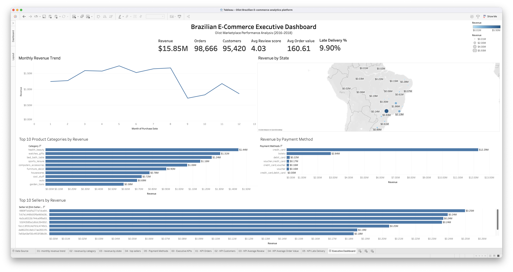

# 📊 Olist E-Commerce Analytics

An end-to-end Data Analytics project analyzing over **100,000 Brazilian e-commerce orders** from the Olist marketplace. This project demonstrates the complete analytics lifecycle—from raw data ingestion and cleaning to SQL-based business analysis, dimensional data modeling, and interactive Tableau dashboards.

The objective was to transform raw transactional data into actionable business insights using industry-standard analytics tools and workflows.

---

## 📸 Executive Dashboard



---

# ✨ Key Features

- Cleaned and transformed raw Olist datasets using Python and Pandas
- Built a relational SQLite database for analytical querying
- Performed business analysis using advanced SQL
- Designed a dimensional star schema for reporting
- Created an interactive Tableau Executive Dashboard
- Generated KPIs and business recommendations from real-world data

---

# 🛠️ Tech Stack

| Category | Technologies |
|-----------|--------------|
| Programming | Python |
| Database | SQLite |
| Query Language | SQL |
| Data Processing | Pandas, NumPy |
| Visualization | Tableau |
| Notebook | Jupyter |
| Version Control | Git, GitHub |

---

# 📂 Repository Structure

```text
olist-ecommerce-analytics/
│
├── data/
│   ├── processed/
│   └── tableau/
│
├── notebooks/
│   ├── 01_data_cleaning.ipynb
│   ├── 02_database_creation.ipynb
│   ├── 03_sql_analysis.ipynb
│   ├── 04_business_insights_sql.ipynb
│   ├── 05_tableau_data_preparation.ipynb
│   ├── 06_data_warehouse.ipynb
│   └── 07_export_for_tableau.ipynb
│
├── sql/
├── images/
├── README.md
└── .gitignore
```

---

# 📊 Dashboard Highlights

The Tableau dashboard provides an executive view of business performance through:

- Revenue
- Orders
- Customers
- Average Order Value
- Customer Ratings
- Monthly Revenue Trend
- Revenue by State
- Revenue by Product Category
- Payment Method Analysis
- Top Performing Sellers

---

# 🏗️ Analytics Workflow

```text
Raw CSV Files
      │
      ▼
Data Cleaning (Python)
      │
      ▼
SQLite Database
      │
      ▼
SQL Analysis
      │
      ▼
Dimensional Modeling
      │
      ▼
Tableau Dashboard
```

---

# ⭐ Data Warehouse Design

A star schema was designed for reporting and dashboard performance.

### Fact Table

- Fact Sales

### Dimension Tables

- Customer
- Product
- Seller
- Time

---

# 📈 Business Questions Answered

- Which product categories generate the highest revenue?
- Which states contribute the most sales?
- Which sellers perform best?
- How do monthly sales trends change over time?
- What payment methods are most frequently used?
- What percentage of orders are delivered late?
- How do customer review scores vary across orders?

---

# 💡 Key Insights

- Revenue is concentrated in a small number of product categories.
- Credit cards are the dominant payment method.
- Approximately 10% of deliveries are delayed.
- Revenue shows strong seasonal fluctuations.
- A relatively small group of sellers contributes a large share of total sales.

---

# 🚀 Getting Started

Clone the repository

```bash
git clone https://github.com/YOUR_USERNAME/olist-ecommerce-analytics.git
```

Install dependencies

```bash
pip install -r requirements.txt
```

Run the notebooks sequentially from:

```
01_data_cleaning.ipynb
```

through

```
07_export_for_tableau.ipynb
```

---

# 📚 Dataset

Dataset used:

**Brazilian E-Commerce Public Dataset by Olist (Kaggle)**

---

# 🔮 Future Improvements

- Deploy dashboard online
- Automate ETL pipeline
- Integrate Power BI dashboard
- Add forecasting using Machine Learning
- Build customer segmentation using clustering

---

## 👨‍💻 Author

**Ayush Giri**

If you found this project useful, feel free to ⭐ the repository.